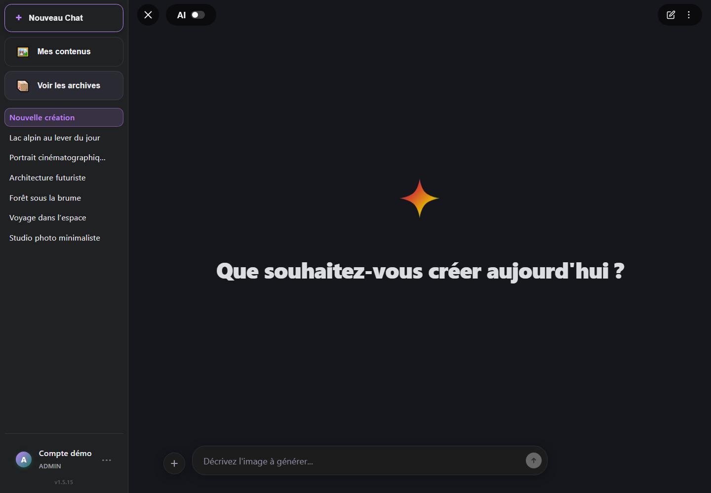
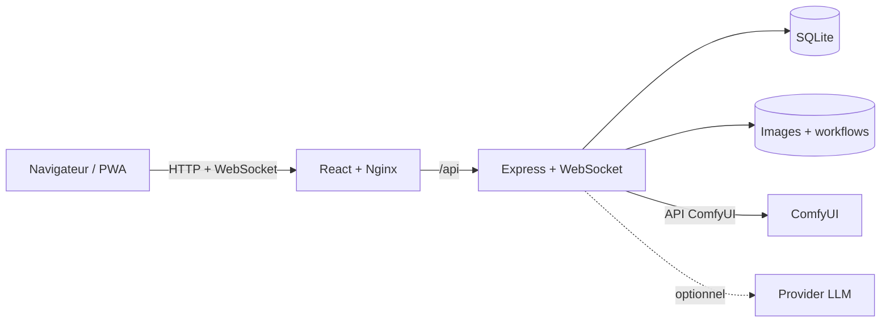

<div align="center">

# ComfyRealism

Une interface web multi-utilisateur pour générer, organiser et retrouver vos
images ComfyUI.

[](https://github.com/leguigou/ComfyRealism/actions/workflows/docker-publish.yml)
[](https://github.com/leguigou/ComfyRealism/actions/workflows/codeql.yml)
[](https://github.com/leguigou/ComfyRealism/releases/latest)
[](LICENSE)

</div>



ComfyRealism associe une application React, une API Express, une base SQLite et
un suivi WebSocket à votre installation ComfyUI. Les images et les comptes
restent hébergés sur votre machine ou votre serveur.

> ComfyRealism ne remplace pas ComfyUI. Une instance ComfyUI fonctionnelle,
> ainsi que les modèles nécessaires à vos workflows, sont indispensables.

## Fonctionnalités

- génération ComfyUI avec progression en temps réel, file d’attente, annulation
  et reprise ;
- historique par conversation, galerie, favoris et archives ;
- comptes isolés et administration multi-utilisateur ;
- import de workflows ComfyUI au format API et association guidée des nœuds ;
- réglage du checkpoint, des dimensions, de la seed, des steps, du CFG, du
  sampler et du scheduler ;
- listes aléatoires réutilisables dans les prompts ;
- amélioration facultative des prompts avec OpenAI, Anthropic, Gemini,
  DeepSeek, xAI, Mistral, Groq, OpenRouter, Together, Ollama ou une API
  compatible OpenAI ;
- chiffrement des clés de providers dans SQLite ;
- miniatures WebP, thèmes clair/sombre, interface responsive et PWA ;
- interface disponible en français et en anglais.

| Options de génération | Interface mobile |
| --- | --- |
|  |  |

## Installation rapide avec Docker

### 1. Prérequis

- Docker Desktop, ou Docker Engine avec Docker Compose v2 ;
- Git ;
- ComfyUI lancé sur le port `8188`.

Si ComfyUI tourne sur la même machine, il doit accepter les connexions venant
de Docker. Sous Linux, cela nécessite généralement de le lancer ainsi :

```bash
python main.py --listen 0.0.0.0 --port 8188
```

N’exposez pas directement ce port sur Internet.

### 2. Télécharger et configurer ComfyRealism

```bash
git clone https://github.com/leguigou/ComfyRealism.git
cd ComfyRealism
```

Sous Windows, l’assistant crée `.env`, demande le mot de passe administrateur
et génère automatiquement une clé secrète :

```powershell
powershell -ExecutionPolicy Bypass -File scripts\init-env.ps1
```

Sous Linux ou macOS :

```bash
sh scripts/init-env.sh
```

Vous pouvez aussi copier `.env.example` vers `.env` et remplacer manuellement
`APP_PASSWORD`, `AUTH_SECRET` et `COMFY_URL`.

### 3. Démarrer

```bash
docker compose -f docker-compose.production.yml up -d
```

Ouvrez <http://localhost:5173>, puis connectez-vous avec :

- utilisateur : `admin` ;
- mot de passe : celui choisi pendant la configuration.

Le mot de passe `APP_PASSWORD` sert uniquement lors de la création du premier
administrateur. Le modifier ensuite dans `.env` ne modifie pas le compte
existant.

### 4. Première génération

1. Ouvrez **Paramètres** et vérifiez la connexion à ComfyUI.
2. Sélectionnez un workflow compatible avec les modèles installés.
3. Saisissez un prompt et lancez la génération.

Les workflows d’exemple peuvent nécessiter des modèles et des nœuds ComfyUI
supplémentaires. Pour commencer avec votre propre workflow, consultez
[le guide des workflows](docs/workflows.md).

## Mise à jour et maintenance

```bash
# Télécharger les dernières images et redémarrer
docker compose -f docker-compose.production.yml pull
docker compose -f docker-compose.production.yml up -d

# Consulter les journaux
docker compose -f docker-compose.production.yml logs -f

# Arrêter sans supprimer les données
docker compose -f docker-compose.production.yml down
```

Les données persistantes se trouvent dans :

- `backend/data` : base SQLite et données applicatives ;
- `backend/workflows` : workflows et associations de nœuds ;
- `images` : images et miniatures, séparées par utilisateur.

Sauvegardez régulièrement ces trois emplacements. Ne les ajoutez jamais à Git.

## Configuration

| Variable | Description | Valeur par défaut |
| --- | --- | --- |
| `APP_PASSWORD` | Mot de passe initial du premier administrateur, 12 caractères minimum | obligatoire |
| `AUTH_SECRET` | Signature des cookies et chiffrement des clés LLM, 32 caractères minimum | obligatoire |
| `COMFY_URL` | URL de ComfyUI vue depuis le backend | `http://host.docker.internal:8188` |
| `FRONTEND_PORT` | Port web exposé par Docker | `5173` |
| `CORS_ORIGINS` | Origines frontend supplémentaires, séparées par des virgules | vide |
| `SERVICE_URL_ALLOWLIST` | Origines ComfyUI/LLM personnalisées autorisées | vide |
| `ALLOW_PRIVATE_SERVICE_URLS` | Autorise les IP littérales privées et de boucle locale | `false` |
| `ALLOW_USER_LLM_URLS` | Autorise chaque utilisateur à choisir librement son URL LLM | `false` |
| `PORT` | Port interne de l’API | `3001` |

Ne changez pas `AUTH_SECRET` après avoir enregistré des clés API sans prévoir
de les ressaisir : elles sont chiffrées avec une clé dérivée de ce secret.

### Accès distant

Pour un accès depuis Internet, placez le port web derrière un reverse proxy
HTTPS tel que Caddy, Traefik ou Nginx. N’exposez ni ComfyUI ni le backend
directement. Consultez également la [politique de sécurité](SECURITY.md).

## Développement local

Prérequis : Node.js 22, npm et ComfyUI.

Créez une configuration dédiée au backend :

```powershell
# Windows
powershell -ExecutionPolicy Bypass -File scripts\init-env.ps1 -Development
```

```bash
# Linux ou macOS
sh scripts/init-env.sh --development
```

Installez les dépendances :

```bash
cd backend
npm ci
cd ../frontend
npm ci
cd ..
```

Vous pouvez ensuite lancer `run.bat` sous Windows ou `bash run.sh` sous Linux et
macOS. Il est également possible d’exécuter `npm run dev` séparément dans les
dossiers `backend` et `frontend`.

L’application de développement est disponible sur <http://localhost:5173>.
Vite redirige automatiquement `/api` et les WebSockets vers le backend.

## Vérifications

```bash
cd backend
npm audit --audit-level=high
npm test
npm run build

cd ../frontend
npm audit --audit-level=high
npm run lint
npm test
npm run build
```

Ces vérifications sont exécutées automatiquement par GitHub Actions. Dependabot
surveille également npm et les actions GitHub, tandis que CodeQL analyse le
code JavaScript et TypeScript.

## Architecture



```text
frontend/           application React, Vite et TypeScript
backend/            API Express, WebSocket et SQLite
backend/workflows/  workflows ComfyUI et associations de nœuds
docs/               documentation et captures
scripts/            assistants de configuration
.github/            CI, sécurité et modèles de contribution
```

## Dépannage

### ComfyUI est inaccessible

- Vérifiez que ComfyUI répond sur `http://127.0.0.1:8188` depuis l’hôte.
- Vérifiez `COMFY_URL` dans `.env`.
- Sous Linux, lancez ComfyUI avec `--listen 0.0.0.0`.
- Consultez les journaux avec `docker compose -f docker-compose.production.yml logs backend`.

### Un modèle ou un nœud est introuvable

Le workflow référence un fichier ou une extension absente de ComfyUI. Ouvrez le
workflow dans ComfyUI, installez les nœuds manquants, puis vérifiez les noms des
modèles. Consultez [docs/workflows.md](docs/workflows.md).

### Le port 5173 est déjà utilisé

Modifiez `FRONTEND_PORT` dans `.env`, par exemple :

```dotenv
FRONTEND_PORT=8080
```

### Le mot de passe défini dans `.env` ne fonctionne plus

`APP_PASSWORD` n’est lu que lors de la création initiale du compte `admin`.
Utilisez l’administration de l’application pour modifier un mot de passe
existant.

## Contribution et licence

Les contributions sont bienvenues. Lisez [CONTRIBUTING.md](CONTRIBUTING.md) et
le [code de conduite](CODE_OF_CONDUCT.md) avant d’ouvrir une pull request.

Le code de ComfyRealism est distribué sous [licence MIT](LICENSE). ComfyUI, les
modèles, les LoRA, les VAE et les workflows tiers peuvent avoir leurs propres
licences et conditions d’utilisation.
